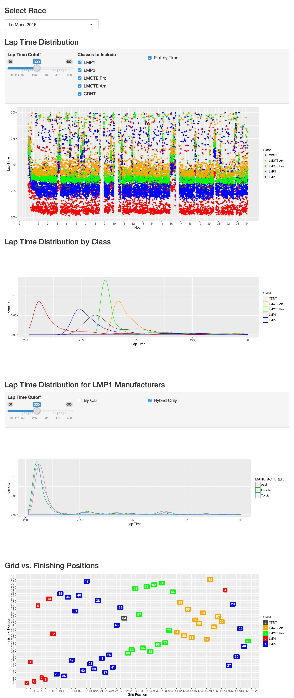

WEC-Analysis
============

R scripts to analyze and visualize data from World Endurance Championship races.

# `download.py`
Downloads data provided by [fiawec.alkamelsystems.com](http://fiawec.alkamelsystems.com).

For the PDF to CSV conversion (for starting positions) to work, you need to download the jar from [tabula-java](https://github.com/tabulapdf/tabula-java).

# `WEC_Analysis.R`
R script to perform analysis on the downloaded data. It provides:

 - `Grid` and `Classification`
 - `Positions`: Grid vs finishing positions
 - `Analysis`: The chronological analysis data
 - `Events`: Events for lap and sector arrivals

# `Report_Interactive.Rmd`
Interactive app for exploring lap time distribution and finishing positions of WEC races.
Requires [Shiny](http://shiny.rstudio.com) to run.

## Screenshot

